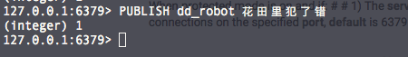
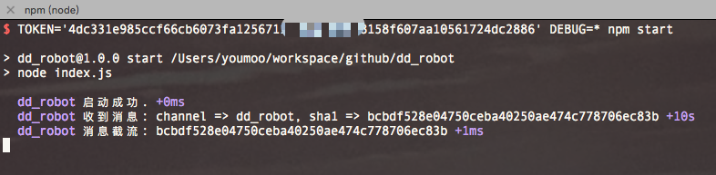
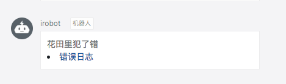

钉钉机器人预警
===========

1. 用途: 错误预警与通知


### 发布

```bash
git clone https://github.com/Youmoo/dd_robot.git
cd dd_robot
npm i
npm start
```

#### 支持的环境参数

- `REDIS_HOST`: redis的ip, 127.0.0.1
- `REDIS_PORT`: redis监听端口
- `REDIS_PASSWORD`: redis密码
- `LOG_DIR`： 收到错误日志写在哪里，默认为项目下logs文件夹. 必须是绝对路径
- `LOG_HOST`: 错误日志通过该域名访问,比如 *https://example.com*
- `TOKEN`: 钉钉机器人的token

### 原理

应用在需要预警时，通过redis发预警信息到一个名叫`dd_robot`的channel，本项目一直监听该channel，收到信息后将其写入到本地，并发送到钉钉群.


### 示例






